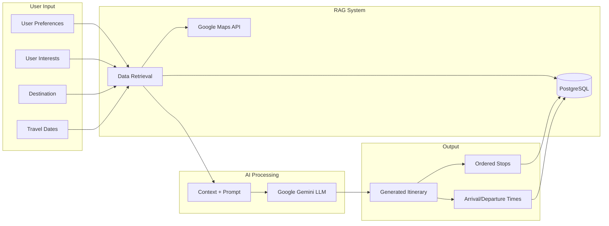
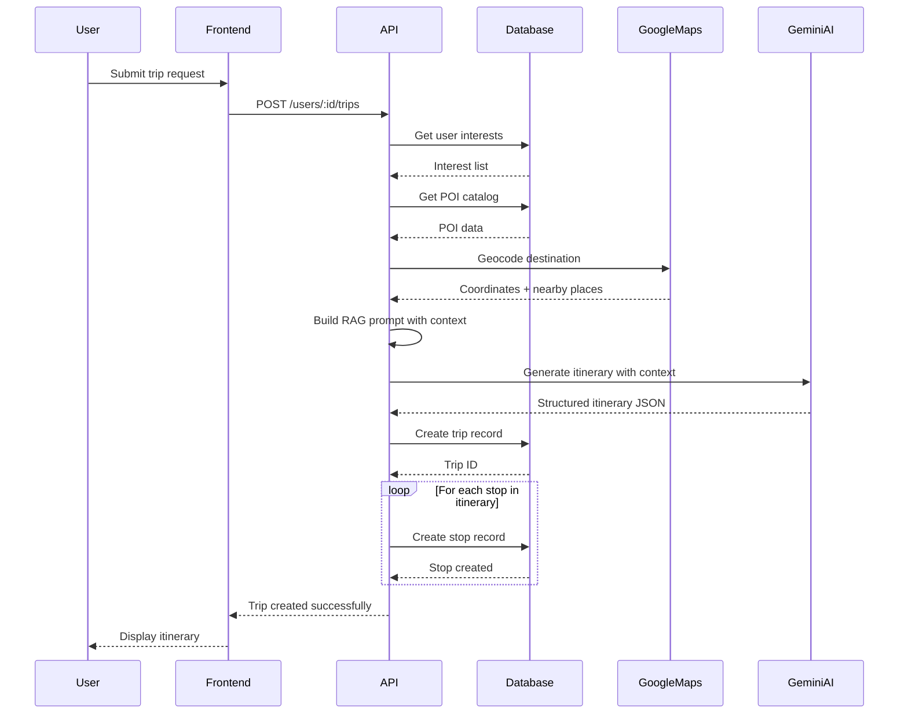

## AI Overview

MayTravel leverages **Google Gemini** large language model with **Retrieval-Augmented Generation (RAG)** to provide intelligent, personalized travel itinerary planning. The AI system generates context-aware trip recommendations based on user preferences, interests, and real-world data.

## AI Technology Stack

### Core AI Components

- **AI Model**: Google Gemini
- **Technique**: RAG (Retrieval-Augmented Generation)
- **Data Sources**: 
  - User interests from PostgreSQL database
  - POI catalog with real-world locations
  - Google Maps Platform for geolocation data
- **Integration Point**: Node.js/Express backend



## What is RAG?

**Retrieval-Augmented Generation** combines the power of large language models with external data retrieval:

### Traditional LLM Approach
```
User Query → LLM → Generated Response
```
- Limited to training data
- May hallucinate facts
- No access to current/specific information

### RAG Approach
```
User Query → Retrieve Relevant Data → Augment Prompt with Data → LLM → Contextual Response
```
- Grounds responses in real data
- Reduces hallucinations
- Provides up-to-date, specific information
- Enables domain-specific expertise

## RAG Implementation in MayTravel

### Step 1: Data Retrieval

When a user requests trip planning, the system retrieves relevant context:

#### User Context Retrieval

```javascript
// Get user interests from database
const userInterests = await UsersModel.getInterests(userId)
// Returns: [{interest_name: 'museums'}, {interest_name: 'food'}, ...]
```

See `UsersModel.mjs:44-47` for implementation.

#### POI Catalog Retrieval

```javascript
// Get relevant POIs for destination
const pois = await PoisModel.getAll()
// Filter by category, location, user interests
// Returns: POIs with names, addresses, coordinates, categories, hours
```

See `PoisModel.mjs:4-7` for implementation.

#### Geolocation Data

```javascript
// Get destination coordinates and nearby places from Google Maps
const locationData = await googleMapsAPI.geocode(destination)
const nearbyPlaces = await googleMapsAPI.nearbySearch({
  location: locationData.coordinates,
  radius: 5000,
  types: userInterests
})
```

### Step 2: Context Augmentation

Retrieved data is formatted into a structured prompt for Gemini:

```javascript
const prompt = `
You are an expert travel planner. Create a detailed itinerary for the following trip:

DESTINATION: ${destination}
DATES: ${arrive_date} to ${leave_date}
ACCOMMODATION: ${shelter_address} (${shelter_lat}, ${shelter_lng})

USER INTERESTS:
${userInterests.map(i => `- ${i.interest_name}`).join('\n')}

AVAILABLE POINTS OF INTEREST:
${pois.map(poi => `
- ${poi.name} (${poi.category})
  Address: ${poi.address}
  Coordinates: ${poi.lat}, ${poi.lng}
  Hours: ${poi.open_time} - ${poi.close_time}
  Average visit: ${poi.average_stay_minutes} minutes
`).join('\n')}

Please create a day-by-day itinerary with:
1. Ordered list of stops (activities/POIs)
2. Arrival and departure times for each stop
3. Travel time between locations
4. Recommendations based on user interests

Format your response as JSON:
{
  "days": [
    {
      "date": "YYYY-MM-DD",
      "stops": [
        {
          "poi_id": 123,
          "arrival_time": "09:00",
          "departure_time": "11:00",
          "order": 1
        }
      ]
    }
  ]
}
`
```

### Step 3: AI Generation

```javascript
import { GoogleGenerativeAI } from '@google/generative-ai'

const genAI = new GoogleGenerativeAI(process.env.GEMINI_API_KEY)
const model = genAI.getGenerativeModel({ model: 'gemini-pro' })

const result = await model.generateContent(prompt)
const itinerary = JSON.parse(result.response.text())
```

### Step 4: Database Persistence

AI-generated itinerary is stored in PostgreSQL:

```javascript
// Create trip record
await TripsModel.create({
  title: destination,
  lat: shelter_lat,
  lng: shelter_lng,
  arrive_date,
  leave_date
}, userId)

// Create stops for each AI-generated activity
for (const stop of itinerary.stops) {
  await StopsModel.create({
    trip_id: tripId,
    poi_catalog_id: stop.poi_id,
    stop_order: stop.order,
    arrival_time: stop.arrival_time,
    departure_time: stop.departure_time
  })
}
```

See `TripsModel.mjs:22-28` and `StopsModel.mjs:4-16` for implementation.

## AI-Powered Features

### 1. Personalized Itinerary Generation

**Input**:
- User interests (museums, food, hiking, etc.)
- Travel dates and duration
- Accommodation location
- Budget preferences (future)

**AI Processing**:
- Analyzes user interests from database
- Retrieves relevant POIs matching interests
- Considers geographic proximity to shelter
- Accounts for POI operating hours
- Optimizes travel routes
- Balances activity types

**Output**:
- Day-by-day itinerary
- Ordered stops with timing
- Travel time estimates
- Activity recommendations

### 2. Intelligent Scheduling

AI considers multiple factors when scheduling:

```javascript
// AI evaluates:
- poi.open_time / poi.close_time          // Operating hours
- poi.average_stay_minutes                // Visit duration
- ST_Distance(shelter, poi.location)      // Travel distance
- user_interests matching poi.category    // Relevance
- stop_order optimization                 // Logical flow
```

### 3. Context-Aware Recommendations

RAG enables the AI to:
- Recommend POIs that actually exist in the database
- Provide accurate addresses and coordinates
- Respect real-world constraints (hours, distance)
- Avoid recommending closed venues
- Suggest alternative activities for bad weather (future)

### 4. Clothing Recommendations (Planned)

> "(IA) Recomendación de ropa"

Future AI feature to suggest appropriate clothing based on:
- Destination weather forecast
- Planned activities (hiking, dining, etc.)
- Cultural considerations
- Season and climate

## Data Flow: AI Trip Generation



## Why RAG Over Fine-Tuning?

### Advantages of RAG for MayTravel

1. **Dynamic Data**: POI catalog changes frequently (new restaurants, closed venues)
2. **User-Specific**: Each trip is unique to user's interests
3. **Cost-Effective**: No expensive model retraining
4. **Transparency**: Can see what data influenced the response
5. **Accuracy**: Grounds AI in real database records
6. **Flexibility**: Easy to add new data sources

### RAG vs Fine-Tuning Comparison

| Aspect | RAG | Fine-Tuning |
|--------|-----|-------------|
| **Data Updates** | Instant - query database | Requires retraining |
| **Cost** | Pay per API call | High training costs |
| **Accuracy** | Grounded in real data | May hallucinate |
| **Customization** | Per-user context | Model-wide changes |
| **Maintenance** | Update database | Retrain periodically |
| **Transparency** | Traceable sources | Black box |

## AI Flexibility & Database Design

### Handling Dynamic AI Responses

PostgreSQL's flexibility accommodates varying AI output structures:

#### Approach 1: Structured Schema (Current)

Fixed schema with well-defined fields:
```sql
CREATE TABLE stops (
  id SERIAL PRIMARY KEY,
  trip_id INTEGER,
  poi_catalog_id INTEGER,
  stop_order INTEGER,
  arrival_time TIME,
  departure_time TIME
);
```

**Pros**: Type safety, query performance, referential integrity
**Cons**: Less flexible if AI generates new field types

#### Approach 2: JSONB Storage (Future Option)

Store AI responses as semi-structured JSON:
```sql
CREATE TABLE trip_itineraries (
  id SERIAL PRIMARY KEY,
  trip_id INTEGER,
  ai_response JSONB,
  created_at TIMESTAMP
);
```

**Example JSONB content**:
```json
{
  "stops": [
    {
      "poi_id": 42,
      "arrival": "09:00",
      "departure": "11:00",
      "order": 1,
      "notes": "Best time to visit before crowds",
      "weather_dependent": false,
      "ai_confidence": 0.95
    }
  ],
  "clothing_recommendations": [
    "Light jacket",
    "Comfortable walking shoes"
  ],
  "total_walking_distance_km": 5.2,
  "estimated_budget_usd": 150
}
```

**Pros**: Handles any AI output structure, easy to extend
**Cons**: Less query performance, harder to enforce constraints

#### Hybrid Approach (Recommended)

Combine structured and flexible storage:
```sql
CREATE TABLE stops (
  id SERIAL PRIMARY KEY,
  trip_id INTEGER,
  poi_catalog_id INTEGER,
  stop_order INTEGER NOT NULL,
  arrival_time TIME,
  departure_time TIME,
  ai_metadata JSONB  -- Additional AI-generated fields
);
```

This allows:
- Core fields remain queryable and indexed
- AI can add supplementary data in `ai_metadata`
- Schema evolution without migrations

## Google Maps Integration

### Geolocation Services

Google Maps Platform provides:

1. **Geocoding**: Convert addresses to coordinates
   ```javascript
   const coords = await geocode('Eiffel Tower, Paris')
   // Returns: { lat: 48.8584, lng: 2.2945 }
   ```

2. **Places API**: Find POIs near location
   ```javascript
   const places = await nearbySearch({
     location: { lat: 48.8584, lng: 2.2945 },
     radius: 5000,
     type: 'museum'
   })
   ```

3. **Directions API**: Calculate routes and travel time
   ```javascript
   const route = await directions({
     origin: shelterLocation,
     destination: poiLocation,
     mode: 'walking'
   })
   // Returns: duration, distance, steps
   ```

4. **Distance Matrix**: Optimize multi-stop routes
   ```javascript
   const matrix = await distanceMatrix({
     origins: [shelter, poi1, poi2],
     destinations: [poi1, poi2, poi3]
   })
   // AI uses this to optimize stop order
   ```

## AI Quality & Safeguards

### Prompt Engineering Best Practices

1. **Structured Output**: Request JSON format for parsing
2. **Constraints**: Specify operating hours, distances
3. **Validation**: Include rules in prompt
4. **Few-Shot Examples**: Provide example itineraries
5. **Temperature Control**: Lower temperature for factual responses

### Response Validation

```javascript
function validateItinerary(aiResponse) {
  // Ensure all POI IDs exist in database
  for (const stop of aiResponse.stops) {
    if (!await PoisModel.getById(stop.poi_id)) {
      throw new Error('Invalid POI ID from AI')
    }
  }
  
  // Verify times are logical
  for (let i = 0; i < aiResponse.stops.length - 1; i++) {
    const current = aiResponse.stops[i]
    const next = aiResponse.stops[i + 1]
    
    if (current.departure_time >= next.arrival_time) {
      throw new Error('Invalid timing sequence')
    }
  }
  
  // Check POI operating hours
  for (const stop of aiResponse.stops) {
    const poi = await PoisModel.getById(stop.poi_id)
    if (stop.arrival_time < poi.open_time || stop.departure_time > poi.close_time) {
      throw new Error('Stop outside POI operating hours')
    }
  }
  
  return true
}
```

### Fallback Strategies

1. **Retry Logic**: Retry failed AI requests with adjusted prompts
2. **Default Itineraries**: Provide template itineraries if AI fails
3. **User Editing**: Allow users to modify AI suggestions
4. **Confidence Scores**: Store AI confidence for each recommendation

## Future AI Enhancements

### Planned Features

1. **Real-Time Updates**
   - Dynamic itinerary adjustments based on weather
   - Traffic-aware schedule modifications
   - Alternative POIs if venues close unexpectedly

2. **Multi-Modal Planning**
   - Integration of public transit
   - Walking vs. driving optimization
   - Accessibility considerations

3. **Budget Optimization**
   - Cost estimates for activities
   - Budget-aware recommendations
   - Free vs. paid activity balancing

4. **Social Features**
   - Group itinerary coordination
   - Shared interests across travelers
   - Collaborative trip planning

5. **Learning & Improvement**
   - User feedback on recommendations
   - Iterative itinerary refinement
   - Personalization over time

6. **Clothing & Packing**
   - Weather-based packing lists
   - Activity-appropriate attire
   - Cultural dress code guidance

### Advanced RAG Techniques

1. **Vector Embeddings**
   - Semantic search for similar POIs
   - Interest matching beyond keywords
   - Content-based recommendations

2. **Hybrid Retrieval**
   - Combine keyword search and semantic search
   - Multiple data sources (reviews, blogs, guides)
   - Real-time web scraping for current info

3. **Query Expansion**
   - "Museums" → "art galleries, historical sites, exhibitions"
   - Broaden interest matching

4. **Relevance Ranking**
   - Score POIs by relevance to user
   - Prioritize highly-rated venues
   - Balance popularity with user preferences

## Performance Considerations

### AI Request Optimization

1. **Caching**: Cache AI responses for similar requests
   ```javascript
   const cacheKey = `itinerary:${destination}:${interests.join('-')}:${dates}`
   const cached = await redis.get(cacheKey)
   if (cached) return JSON.parse(cached)
   ```

2. **Batch Processing**: Generate multiple days in one request
3. **Streaming**: Stream AI responses for better UX
4. **Rate Limiting**: Respect Gemini API quotas

### Cost Management

1. **Token Optimization**: Minimize prompt length while preserving context
2. **Model Selection**: Use appropriate Gemini model tier
3. **Fallback to Templates**: Use AI sparingly for common scenarios
4. **User Quotas**: Limit AI generations per user

## Related Documentation

- [System Architecture Overview](/architecture/overview) - Complete system design
- [Database Architecture](/architecture/database) - Data model details
