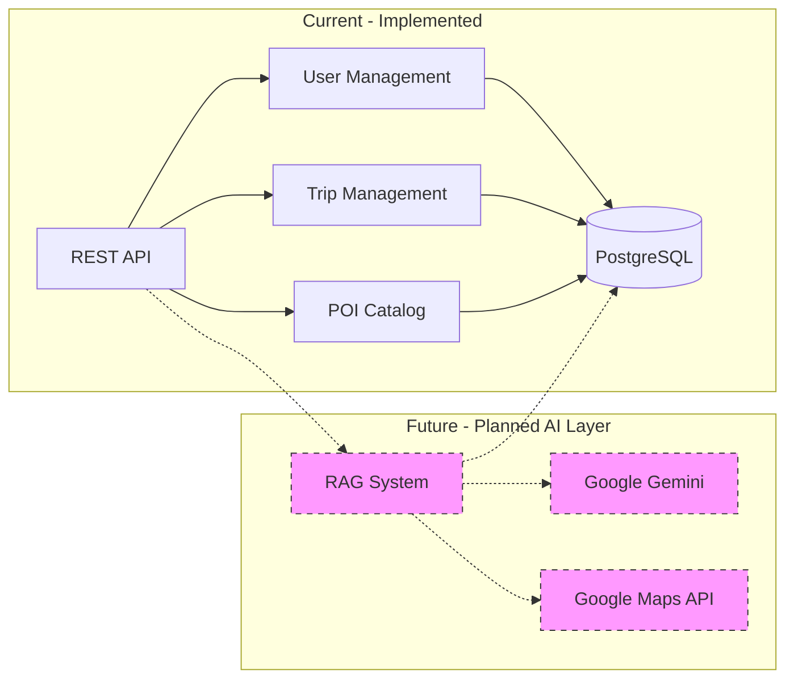

<Warning>
  **Development Status**: The AI integration described in this document is currently in the planning phase. The MayTravel backend currently provides a complete REST API for trip management, but AI-powered itinerary generation is not yet implemented.
</Warning>

## Overview

MayTravel is designed to leverage **Google Gemini** with **Retrieval-Augmented Generation (RAG)** for intelligent travel planning. While the core API infrastructure is in place, the AI features are planned for future implementation.

## Current Implementation Status

### ✅ Implemented Features

The following backend components are **fully operational**:

- User authentication and profile management
- Interest catalog and user interest associations
- Trip CRUD operations (create, read, delete trips)
- Points of Interest (POI) catalog management
- Stop management for trip itineraries
- PostgreSQL database with PostGIS for geospatial data
- REST API endpoints for all resources

### 🚧 Planned AI Features

The following AI-powered features are **planned but not yet implemented**:

- Google Gemini integration for itinerary generation
- RAG-based context retrieval and augmentation
- Intelligent POI recommendations based on interests
- Automated trip scheduling and optimization
- Google Maps Platform integration for routing
- Weather-based clothing recommendations

## Planned AI Architecture

The system architecture is designed to support AI integration when implemented:



## What is RAG?

**Retrieval-Augmented Generation** is a technique that combines large language models with external data retrieval to provide more accurate, contextual responses.

### Traditional LLM Approach
```
User Query → LLM → Generated Response
```
- Limited to training data
- May hallucinate facts
- No access to current/specific information

### RAG Approach (Planned)
```
User Query → Retrieve Relevant Data → Augment Prompt → LLM → Contextual Response
```
- Grounds responses in real data
- Reduces hallucinations
- Provides up-to-date, specific information
- Enables domain-specific expertise

## Planned Implementation Steps

When AI integration is implemented, the workflow will be:

### Step 1: Data Retrieval

Retrieve relevant context from the existing database:

```javascript
// Get user interests from database
const userInterests = await UsersModel.getInterests(userId)
// Returns: [{interest_name: 'museums'}, {interest_name: 'food'}, ...]

// Get POI catalog
const pois = await PoisModel.getAll()
// Returns: POIs with names, addresses, coordinates, categories, hours
```

**Currently available in**: `UsersController.mjs:107-115` and `PoisController.mjs:5-12`

### Step 2: Context Augmentation (Planned)

Build a structured prompt with retrieved data:

```javascript
// This code is planned, not yet implemented
const prompt = `
You are an expert travel planner. Create a detailed itinerary for:

DESTINATION: ${destination}
DATES: ${arrive_date} to ${leave_date}
ACCOMMODATION: ${shelter_coordinates}

USER INTERESTS:
${userInterests.map(i => `- ${i.interest_name}`).join('\n')}

AVAILABLE POINTS OF INTEREST:
${pois.map(poi => `
- ${poi.name} (${poi.category})
  Address: ${poi.address}
  Coordinates: ${poi.lat}, ${poi.lng}
`).join('\n')}

Format response as JSON with ordered stops and timing.
`
```

### Step 3: AI Generation (Planned)

```javascript
// This integration is planned, not yet implemented
import { GoogleGenerativeAI } from '@google/generative-ai'

const genAI = new GoogleGenerativeAI(process.env.GEMINI_API_KEY)
const model = genAI.getGenerativeModel({ model: 'gemini-pro' })

const result = await model.generateContent(prompt)
const itinerary = JSON.parse(result.response.text())
```

### Step 4: Database Persistence (Ready)

The database schema is **already designed** to store AI-generated itineraries:

```javascript
// These models are already implemented and operational

// Create trip record
await TripsModel.create({
  title: destination,
  lat: shelter_lat,
  lng: shelter_lng,
  arrive_date,
  leave_date
}, userId)

// Create stops for each AI-generated activity
for (const stop of itinerary.stops) {
  await StopsModel.create({
    trip_id: tripId,
    poi_catalog_id: stop.poi_id,
    stop_order: stop.order,
    arrival_time: stop.arrival_time,
    departure_time: stop.departure_time
  })
}
```

**Implementation reference**: `TripsModel.mjs` and `StopsModel.mjs` in `~/workspace/source/backend/src/components/`

## Database Design for AI Flexibility

The PostgreSQL database is intentionally designed to accommodate dynamic AI outputs:

### Current Schema

```sql
-- Trips table stores basic trip information
CREATE TABLE trips (
  id SERIAL PRIMARY KEY,
  title VARCHAR(255),
  shelter GEOMETRY(Point, 4326),  -- PostGIS for geospatial data
  arrive_date DATE,
  leave_date DATE,
  user_id INTEGER REFERENCES users(id)
);

-- Stops table stores itinerary details
CREATE TABLE stops (
  id SERIAL PRIMARY KEY,
  trip_id INTEGER REFERENCES trips(id),
  poi_catalog_id INTEGER REFERENCES poi_catalog(id),
  stop_order INTEGER,
  arrival_time TIME,
  departure_time TIME
);
```

### Design Rationale

From the project README:

> "Se hace uso de PostgresSQL debido a que, en caso de que la IA decida agregar nuevos campos a la tabla de itinerarios, esta no se rompa"

PostgreSQL was chosen specifically for its flexibility to handle dynamic schema changes when AI adds new fields to itinerary tables.

### Future Extension Options

The schema can be extended without breaking changes:

**Option 1: Add columns as needed**
```sql
ALTER TABLE stops 
ADD COLUMN ai_confidence DECIMAL,
ADD COLUMN weather_dependent BOOLEAN,
ADD COLUMN notes TEXT;
```

**Option 2: JSONB for flexible AI metadata**
```sql
ALTER TABLE stops 
ADD COLUMN ai_metadata JSONB;
```

This allows AI to store arbitrary additional information while maintaining core structured fields.

## Planned AI Features

### 1. Personalized Itinerary Generation

**Inputs** (all available via current API):
- User interests from `GET /users/:id/interests`
- POI catalog from `GET /pois`
- Trip dates and location from `POST /users/:id/trips`

**Planned AI Processing**:
- Analyze user interests
- Match relevant POIs
- Consider geographic proximity
- Account for operating hours
- Optimize travel routes

**Output** (database-ready):
- Structured trip with ordered stops
- Timing for each activity
- Stored via existing API endpoints

### 2. Intelligent Scheduling

AI will consider:
- POI opening/closing times
- Visit duration estimates
- Travel distances (PostGIS `ST_Distance`)
- User interest relevance
- Logical activity sequencing

### 3. Clothing Recommendations

From README: "(IA) Recomendación de ropa"

Planned feature to suggest appropriate clothing based on:
- Destination weather
- Planned activities
- Season and climate
- Cultural considerations

## Why RAG for Travel Planning?

### Advantages

1. **Dynamic Data**: POI catalog updates don't require model retraining
2. **User-Specific**: Each itinerary customized to individual interests
3. **Cost-Effective**: No expensive fine-tuning
4. **Transparency**: Can trace which data influenced recommendations
5. **Accuracy**: Grounded in real database records
6. **Flexibility**: Easy to add new data sources

### RAG vs Fine-Tuning

| Aspect | RAG (Planned) | Fine-Tuning |
|--------|---------------|-------------|
| **Data Updates** | Instant via database | Requires retraining |
| **Cost** | API calls only | High training costs |
| **Accuracy** | Grounded in real data | May hallucinate |
| **Customization** | Per-user context | Model-wide |
| **Maintenance** | Update database | Retrain periodically |

## Google Maps Integration (Planned)

Planned geolocation services:

1. **Geocoding**: Convert addresses to coordinates
2. **Places API**: Find POIs near destination
3. **Directions API**: Calculate routes and travel time
4. **Distance Matrix**: Optimize multi-stop itineraries

The database already uses PostGIS `POINT` geometry for storing geographic coordinates, ready for Maps API integration.

## Implementation Roadmap

### Phase 1: Infrastructure (✅ Complete)
- REST API endpoints
- Database schema with PostGIS
- User, trip, POI, and stop management
- Authentication system

### Phase 2: AI Integration (🚧 Planned)
- Google Gemini API integration
- RAG prompt engineering
- Response parsing and validation
- Error handling and fallbacks

### Phase 3: Maps Integration (🚧 Planned)
- Google Maps Platform setup
- Geocoding and place search
- Route optimization
- Distance calculations

### Phase 4: Advanced Features (🚧 Future)
- Real-time weather integration
- Clothing recommendations
- Budget optimization
- Multi-modal transport planning

## Development Notes

### Required Dependencies (Not Yet Installed)

When implementing AI features, add these to `package.json`:

```json
{
  "dependencies": {
    "@google/generative-ai": "^0.x.x",
    "@googlemaps/google-maps-services-js": "^3.x.x"
  }
}
```

### Environment Variables (Not Yet Configured)

```bash
# Required for AI integration
GEMINI_API_KEY=your_gemini_api_key_here
GOOGLE_MAPS_API_KEY=your_maps_api_key_here
```

### API Endpoint Modification (Planned)

The existing `POST /users/:id/trips` endpoint will be enhanced to:

1. Accept user preferences and destination
2. Trigger AI itinerary generation
3. Store AI-generated stops automatically
4. Return complete itinerary

Current endpoint creates trips manually; future version will create AI-powered itineraries.

## Current Workaround

Without AI integration, users can:

1. Create trips manually via `POST /users/:id/trips`
2. Add stops manually via `POST /stops`
3. Manage POIs via the POI endpoints
4. Associate interests via `POST /users/:id/interests`

This provides full manual trip planning capabilities while AI features are in development.

## Related Documentation

- [System Architecture Overview](/architecture/overview) - Current system design
- [Database Architecture](/architecture/database) - Schema and data model
- [Trip Management API](/api/trips/overview) - Manual trip creation
- [POI Management API](/api/pois/overview) - POI catalog endpoints
