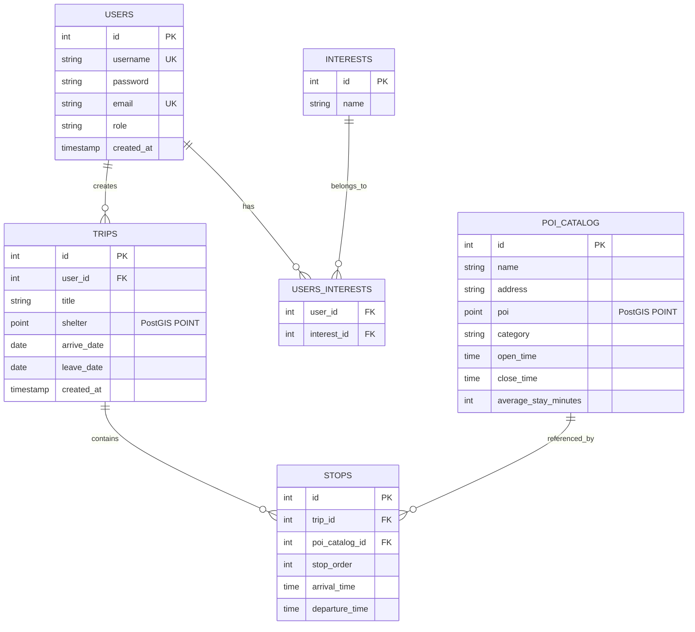
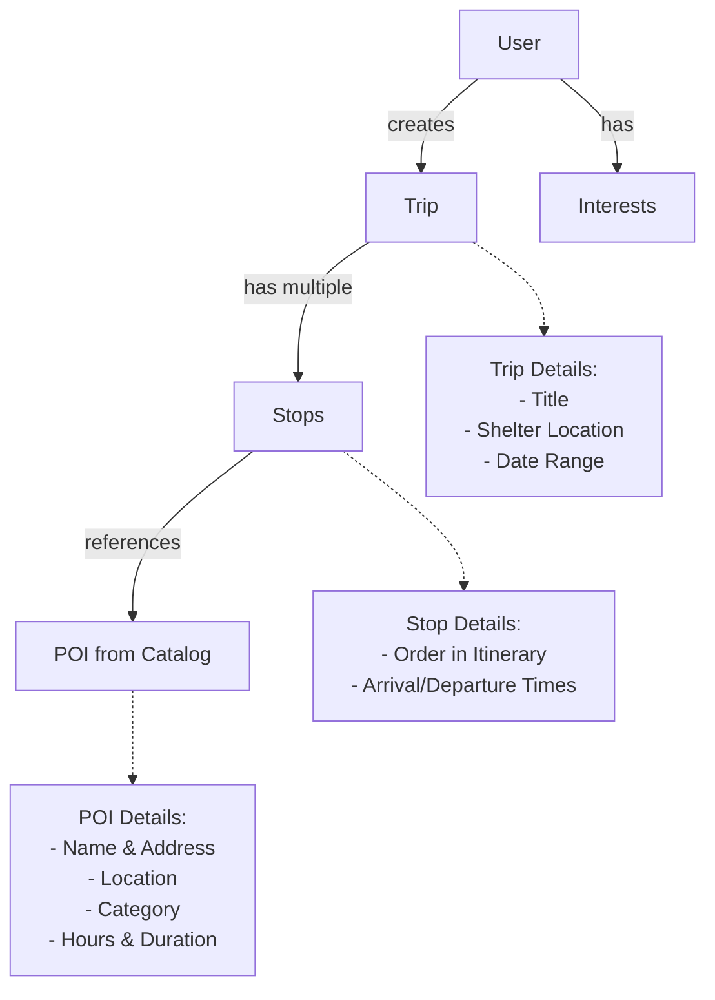

## Database Overview

MayTravel uses **PostgreSQL** as its primary database management system, with **PostGIS** extension for geospatial functionality. The database is designed to support AI-generated travel itineraries with flexible schema that can accommodate dynamic fields.

### Database Configuration

Connection details (`backend/src/databases/postgres-db/maytraveldb.mjs:4-10`):

```javascript
const pgdb = new Client({
  user: 'postgres',
  password: 'admin',
  host: 'localhost',
  port: 5432,
  database: 'MayTravel'
})
```

<Warning>
  All database operations must use `await` keyword, including the initial connection and asynchronous function calls.
</Warning>

## Why PostgreSQL?

PostgreSQL was chosen for several strategic reasons:

### 1. Schema Flexibility

> "Se hace uso de PostgresSQL debido a que, en caso de que la IA decida agregar nuevos campos a la table de intinerarios, esta no se rompa"

PostgreSQL provides the flexibility needed when AI models generate itineraries with varying structures:
- **JSON/JSONB Support**: Can store semi-structured AI responses
- **Dynamic Columns**: Schema can evolve without breaking existing data
- **Extensibility**: Custom types and functions for domain-specific logic

### 2. Data Integrity & Relationships

> "De igual forma postgresSQL maneja integridad y relacionalidad de datos además de la flexibilidad para las tablas de intinerarios"

PostgreSQL ensures data consistency through:
- **Foreign Key Constraints**: Maintain relationships between entities
- **ACID Transactions**: Reliable data operations
- **Referential Integrity**: Cascading updates and deletes
- **Complex Queries**: Powerful JOIN operations for data aggregation

### 3. Geospatial Capabilities

With PostGIS extension:
- **Location Data**: Store and query geographic coordinates
- **Spatial Indexing**: Fast proximity searches
- **Geometry Types**: POINT, LINESTRING, POLYGON support
- **Distance Calculations**: Built-in geospatial functions

## Data Model

The database follows a hierarchical structure for travel itineraries:

```
Trip → Days → Activities → Details
       ↓
    Stops (Activities/POIs)
```

### Entity Relationship Diagram



## Database Schema

### Users Table

Stores user accounts and authentication information.

**Columns:**
- `id` (SERIAL PRIMARY KEY) - Unique user identifier
- `username` (VARCHAR UNIQUE) - User login name (stored lowercase)
- `password` (VARCHAR) - Hashed password
- `email` (VARCHAR UNIQUE) - User email address (stored lowercase)
- `role` (VARCHAR) - User role (default: 'user')
- `created_at` (TIMESTAMP) - Account creation timestamp

**Indexes:**
- Primary key on `id`
- Unique constraint on `username`
- Unique constraint on `email`

**Implementation**: `UsersModel.mjs:1-62`

### Interests Table

Catalog of user interests for personalized recommendations.

**Columns:**
- `id` (SERIAL PRIMARY KEY) - Unique interest identifier
- `name` (VARCHAR) - Interest name (e.g., "museums", "hiking", "food")

**Implementation**: `InterestsModel.mjs:1-31`

### Users_Interests Table

Junction table linking users to their interests (many-to-many relationship).

**Columns:**
- `user_id` (INTEGER FK) - References `users.id`
- `interest_id` (INTEGER FK) - References `interests.id`

**Composite Primary Key**: (`user_id`, `interest_id`)

**Query Example**: `UsersModel.mjs:44-47`
```sql
SELECT users.id, users.username, users.email, 
       interests.name AS interest_name,
       interests.id AS interest_id 
FROM users 
LEFT JOIN users_interests ON users.id = users_interests.user_id 
LEFT JOIN interests ON users_interests.interest_id = interests.id 
WHERE users.id = $1
```

### Trips Table

Core table for travel itineraries.

**Columns:**
- `id` (SERIAL PRIMARY KEY) - Unique trip identifier
- `user_id` (INTEGER FK) - References `users.id`
- `title` (VARCHAR) - Trip name/destination
- `shelter` (GEOMETRY POINT) - Accommodation location (PostGIS)
- `arrive_date` (DATE) - Trip start date
- `leave_date` (DATE) - Trip end date
- `created_at` (TIMESTAMP) - Trip creation timestamp

**Geospatial Implementation**: `TripsModel.mjs:23-26`
```javascript
static async create({ title, lat, lng, arrive_date, leave_date }, userId) {
  const result = await db.query(
    'INSERT INTO trips (user_id, title, shelter, arrive_date, leave_date) VALUES ($1, $2, ST_SetSRID(ST_MakePoint($3, $4), 4326), $5, $6)',
    [userId, title, lng, lat, arrive_date, leave_date]
  )
}
```

<Info>
  The `shelter` field uses PostGIS `ST_SetSRID(ST_MakePoint(lng, lat), 4326)` to store geographic coordinates with SRID 4326 (WGS 84 coordinate system).
</Info>

### POI_Catalog Table

Points of Interest (POI) catalog with detailed location and timing information.

**Columns:**
- `id` (SERIAL PRIMARY KEY) - Unique POI identifier
- `name` (VARCHAR) - POI name
- `address` (VARCHAR) - Street address
- `poi` (GEOMETRY POINT) - Geographic location (PostGIS)
- `category` (VARCHAR) - POI type (museum, restaurant, park, etc.)
- `open_time` (TIME) - Opening time
- `close_time` (TIME) - Closing time
- `average_stay_minutes` (INTEGER) - Typical visit duration

**Implementation**: `PoisModel.mjs:9-33`

**Create POI with Geospatial Data**:
```javascript
INSERT INTO poi_catalog (name, address, poi, category, open_time, close_time, average_stay_minutes) 
VALUES($1, $2, ST_SetSRID(ST_MakePoint($3, $4), 4326), $5, $6, $7, $8)
```

### Stops Table

Itinerary stops linking trips to POIs with scheduling information.

**Columns:**
- `id` (SERIAL PRIMARY KEY) - Unique stop identifier
- `trip_id` (INTEGER FK) - References `trips.id`
- `poi_catalog_id` (INTEGER FK) - References `poi_catalog.id`
- `stop_order` (INTEGER) - Sequence number in itinerary
- `arrival_time` (TIME) - Planned arrival time
- `departure_time` (TIME) - Planned departure time

**Purpose**: Represents individual activities/destinations within a trip itinerary.

**Implementation**: `StopsModel.mjs:4-16`

## Data Relationships

### Trip Hierarchy

The data model implements a hierarchical structure for travel planning:



### Key Relationships

1. **User → Trips** (One-to-Many)
   - A user can create multiple trips
   - Each trip belongs to one user
   - Foreign key: `trips.user_id → users.id`

2. **Trip → Stops** (One-to-Many)
   - A trip contains multiple stops (activities/destinations)
   - Stops are ordered by `stop_order` field
   - Foreign key: `stops.trip_id → trips.id`

3. **POI_Catalog → Stops** (One-to-Many)
   - POI catalog entry can be used in many trip itineraries
   - Each stop references one POI
   - Foreign key: `stops.poi_catalog_id → poi_catalog.id`

4. **User ↔ Interests** (Many-to-Many)
   - Users can have multiple interests
   - Each interest can belong to multiple users
   - Junction table: `users_interests`

## Complex Queries

### Trip Details with Stops

Fetching complete trip information with all stops and POI details (`TripsModel.mjs:30-33`):

```javascript
static async getById(id) {
  const result = await db.query(
    `SELECT trips.title, trips.shelter, trips.arrive_date, trips.leave_date, 
            poi_catalog.name AS spot_name, 
            poi_catalog.category AS spot_label, 
            stops.id AS stop_id, 
            stops.stop_order, 
            stops.arrival_time, 
            stops.departure_time 
     FROM trips 
     LEFT JOIN stops ON trips.id = stops.trip_id 
     LEFT JOIN poi_catalog ON stops.poi_catalog_id = poi_catalog.id 
     WHERE trips.id = $1 
     ORDER BY stop_order ASC`,
    [id]
  )
  return result.rows
}
```

This query demonstrates:
- Multiple LEFT JOINs to gather related data
- Ordering by `stop_order` to maintain itinerary sequence
- Aliasing columns for clarity (`spot_name`, `spot_label`)

### User Trips Overview

Retrieving all trips for a specific user (`TripsModel.mjs:9-15`):

```javascript
static async getByUser(userId) {
  const result = await db.query(
    `SELECT users.id AS user_id, 
            users.username, 
            trips.id AS trip_id, 
            trips.title, 
            trips.shelter, 
            trips.arrive_date, 
            trips.leave_date 
     FROM users 
     LEFT JOIN trips ON users.id = trips.user_id 
     WHERE users.id = $1`,
    [userId]
  )
  return result.rows
}
```

### User Interests with Details

Fetching user profile with interests (`UsersModel.mjs:44-47`):

```javascript
static async getInterests(id){
  const result = await db.query(
    `SELECT users.id, users.username, users.email, 
            interests.name AS interest_name,
            interests.id AS interest_id 
     FROM users 
     LEFT JOIN users_interests ON users.id = users_interests.user_id 
     LEFT JOIN interests ON users_interests.interest_id = interests.id 
     WHERE users.id = $1`,
    [id]
  )
  return result.rows
}
```

## Geospatial Features

### PostGIS Integration

MayTravel leverages PostGIS for location-based functionality:

#### Storing Location Data

**Function**: `ST_SetSRID(ST_MakePoint(longitude, latitude), 4326)`
- `ST_MakePoint()`: Creates a point geometry from coordinates
- `ST_SetSRID()`: Assigns spatial reference system (4326 = WGS 84)
- **Note**: PostGIS expects (longitude, latitude) order, not (latitude, longitude)

#### Example: Storing Trip Shelter Location

```javascript
ST_SetSRID(ST_MakePoint($3, $4), 4326)
// $3 = longitude
// $4 = latitude
```

#### Future Geospatial Queries

PostGIS enables powerful location-based features:

```sql
-- Find POIs within 5km of shelter
SELECT * FROM poi_catalog
WHERE ST_DWithin(
  poi::geography,
  (SELECT shelter::geography FROM trips WHERE id = $1),
  5000  -- meters
);

-- Calculate distance between two POIs
SELECT ST_Distance(
  poi1.poi::geography,
  poi2.poi::geography
) AS distance_meters
FROM poi_catalog poi1, poi_catalog poi2
WHERE poi1.id = $1 AND poi2.id = $2;

-- Order POIs by proximity to shelter
SELECT *, ST_Distance(
  poi::geography,
  (SELECT shelter::geography FROM trips WHERE id = $1)
) AS distance
FROM poi_catalog
ORDER BY distance ASC
LIMIT 10;
```

## Data Integrity

### Parameterized Queries

All database operations use parameterized queries to prevent SQL injection:

```javascript
// Safe - parameterized
await db.query('SELECT * FROM users WHERE id = $1', [userId])

// Unsafe - string concatenation (NOT used in MayTravel)
// await db.query(`SELECT * FROM users WHERE id = ${userId}`)
```

### Input Sanitization

User inputs are sanitized before storage (`UsersModel.mjs:15-18`):

```javascript
static async create({ username, password, email, role = 'user' }) {
  const result = await db.query(
    'INSERT INTO users (username, password, email, role) VALUES ($1, $2, $3, $4)',
    [username.toLowerCase(), password, email.toLowerCase(), role]
  )
}
```

### Foreign Key Constraints

Database enforces referential integrity through foreign keys:
- `trips.user_id` must reference valid `users.id`
- `stops.trip_id` must reference valid `trips.id`
- `stops.poi_catalog_id` must reference valid `poi_catalog.id`

### Cascading Operations

Foreign key constraints should implement cascading rules:
- **ON DELETE CASCADE**: Deleting a trip removes all associated stops
- **ON UPDATE CASCADE**: Updating IDs propagates to related records

## Performance Optimization

### Indexing Strategy

**Recommended Indexes:**

```sql
-- Primary keys (automatic)
CREATE INDEX ON users(id);
CREATE INDEX ON trips(id);
CREATE INDEX ON stops(id);
CREATE INDEX ON poi_catalog(id);
CREATE INDEX ON interests(id);

-- Foreign keys for JOIN performance
CREATE INDEX ON trips(user_id);
CREATE INDEX ON stops(trip_id);
CREATE INDEX ON stops(poi_catalog_id);
CREATE INDEX ON users_interests(user_id);
CREATE INDEX ON users_interests(interest_id);

-- Unique constraints (automatic)
CREATE UNIQUE INDEX ON users(username);
CREATE UNIQUE INDEX ON users(email);

-- Geospatial indexes for location queries
CREATE INDEX ON trips USING GIST(shelter);
CREATE INDEX ON poi_catalog USING GIST(poi);

-- Query optimization indexes
CREATE INDEX ON stops(stop_order);
CREATE INDEX ON poi_catalog(category);
```

### Query Performance Tips

1. **Use EXPLAIN ANALYZE**: Understand query execution plans
2. **Limit Result Sets**: Use LIMIT for pagination
3. **Avoid SELECT ***: Only fetch needed columns
4. **Connection Pooling**: Upgrade from single client to connection pool

## Database Migration Considerations

### AI-Generated Field Flexibility

Since AI may generate varying itinerary structures, consider:

1. **JSONB Columns**: Store semi-structured AI responses
   ```sql
   ALTER TABLE trips ADD COLUMN ai_metadata JSONB;
   ```

2. **EAV Pattern**: Entity-Attribute-Value for dynamic properties
   ```sql
   CREATE TABLE trip_attributes (
     trip_id INTEGER REFERENCES trips(id),
     attribute_name VARCHAR,
     attribute_value TEXT
   );
   ```

3. **Schema Versioning**: Track data model versions
   ```sql
   ALTER TABLE trips ADD COLUMN schema_version INTEGER DEFAULT 1;
   ```

## Backup & Maintenance

### Recommended Practices

1. **Regular Backups**:
   ```bash
   pg_dump -U postgres MayTravel > backup.sql
   ```

2. **Point-in-Time Recovery**: Enable WAL archiving

3. **Vacuum & Analyze**: Maintain table statistics
   ```sql
   VACUUM ANALYZE;
   ```

4. **Monitor Connection Pool**: Prevent connection exhaustion

## Related Documentation

- [System Architecture Overview](/architecture/overview) - Complete system design
- [AI Integration](/architecture/ai-integration) - How AI generates itineraries
