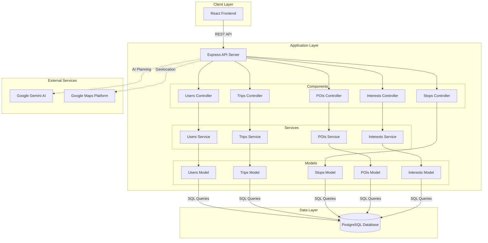
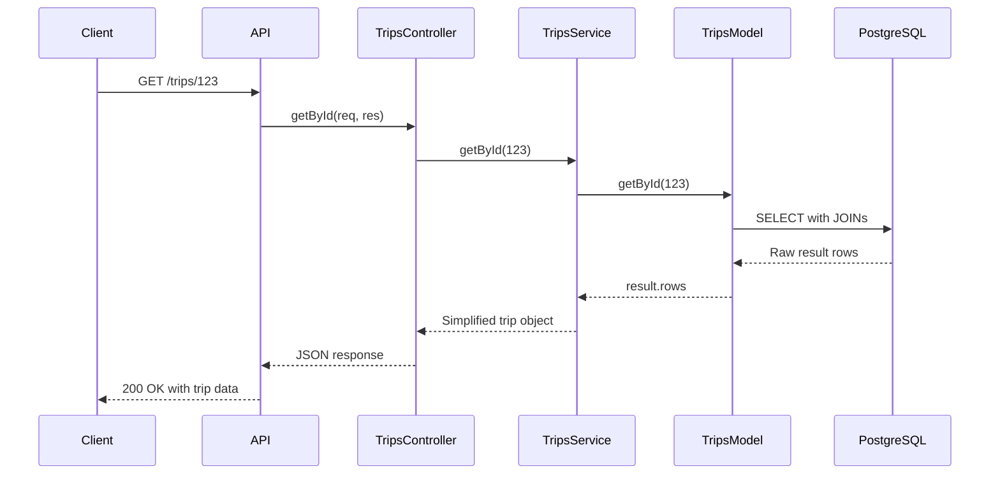

## System Architecture

MayTravel is an AI-powered travel planning assistant built with a modern three-tier architecture. The system combines a React frontend, Node.js/Express backend, and PostgreSQL database with Google Gemini AI integration for intelligent itinerary generation.

## High-Level Architecture



## Component Architecture

### Backend Structure

The backend follows a **Model-View-Controller (MVC)** pattern organized by feature domains:

```
backend/src/
├── app.mjs                    # Application entry point
├── configs/
│   ├── server.mjs            # Express server configuration
│   └── routing.mjs           # API route definitions
├── components/
│   ├── users/
│   │   ├── controller/       # HTTP request handlers
│   │   ├── service/          # Business logic layer
│   │   └── model/            # Database access layer
│   ├── trips/
│   ├── stops/
│   ├── poi_catalog/          # Points of Interest
│   └── interests/
├── databases/
│   └── postgres-db/
│       └── maytraveldb.mjs   # Database connection
└── middlewares/
    ├── UsersValid.mjs        # Validation middleware
    └── cors.mjs              # CORS configuration
```

### Layer Responsibilities

#### Controllers (`backend/src/components/*/controller/`)
- Handle HTTP requests and responses
- Parse request parameters and body
- Invoke service layer methods
- Return appropriate HTTP status codes
- Error handling and user feedback

**Example**: `TripsController.mjs:48-56`
```javascript
static async getById(req, res) {
  try {
    const id = req.params.id
    const result = await TripsService.getById(id)
    res.status(200).send(result)
  } catch (error) {
    res.status(500).send({ error: error.message })
  }
}
```

#### Services (`backend/src/components/*/service/`)
- Implement business logic
- Transform and aggregate data
- Coordinate between multiple models
- Data formatting and simplification

**Example**: `TripsService.mjs:25-46` transforms database results into simplified trip objects with nested stops.

#### Models (`backend/src/components/*/model/`)
- Direct database interaction using PostgreSQL client
- Execute SQL queries with parameterized statements
- Perform CRUD operations
- Return raw database results

**Example**: `TripsModel.mjs:30-33` uses complex JOIN queries to fetch trip details with stops and POI information.

## Technology Stack

### Frontend
- **Framework**: React
- **Purpose**: Single-page application for user interface
- **Location**: `frontend/src/`

### Backend
- **Runtime**: Node.js
- **Framework**: Express 5.2.1
- **Language**: JavaScript (ES Modules)
- **Architecture**: RESTful API
- **Port**: 3000

### Database
- **DBMS**: PostgreSQL
- **Version**: Compatible with pg 8.16.3
- **Extensions**: PostGIS for geospatial data
- **Connection**: `pg` client library

### AI & External Services
- **AI Model**: Google Gemini (with RAG)
- **Geolocation**: Google Maps Platform
- **Integration**: REST API calls from backend

## API Design

### RESTful Endpoints

The API follows REST principles with resource-based routing:

#### Users
- `GET /users` - List all users
- `GET /users/:id` - Get user by ID
- `POST /users` - Create new user
- `PUT /users/:id` - Update user
- `DELETE /users/:id` - Delete user
- `POST /auth/login` - User authentication
- `POST /auth/register` - User registration
- `GET /users/:id/interests` - Get user interests
- `POST /users/:id/interests` - Add interests to user
- `GET /users/:id/trips` - Get user's trips

#### Trips
- `GET /trips` - List all trips
- `GET /trips/:id` - Get trip details with stops
- `POST /users/:id/trips` - Create new trip
- `DELETE /trips/:id` - Delete trip

#### Points of Interest (POIs)
- `GET /pois` - List all POIs
- `POST /pois` - Create new POI
- `PATCH /pois/:id` - Update POI
- `DELETE /pois/:id` - Delete POI

#### Stops
- `POST /stops` - Create stop in trip itinerary

#### Interests
- `GET /interests` - List all interests
- `POST /interests` - Create new interest
- `PUT /interests/:id` - Update interest
- `DELETE /interests/:id` - Delete interest

See `backend/src/configs/routing.mjs:1-65` for complete route definitions.

## Data Flow

### Typical Request Flow

1. **Client Request**: Frontend sends HTTP request to Express API
2. **Routing**: Express router matches URL pattern and method
3. **Middleware**: Request passes through validation/authentication middleware
4. **Controller**: Controller parses request and extracts parameters
5. **Service**: Service layer applies business logic and coordinates data
6. **Model**: Model executes SQL query against PostgreSQL
7. **Database**: PostgreSQL processes query and returns results
8. **Response Chain**: Data flows back through Model → Service → Controller
9. **JSON Response**: Controller sends formatted JSON response to client

### Example: Fetching a Trip with Stops



## Security Considerations

### Database Security
- **Parameterized Queries**: All SQL queries use parameterized statements (`$1`, `$2`) to prevent SQL injection
- **Input Sanitization**: User inputs are sanitized (e.g., `.toLowerCase()` for usernames/emails)

**Example**: `UsersModel.mjs:15-18`
```javascript
const result = await db.query(
  'INSERT INTO users (username, password, email, role) VALUES ($1, $2, $3, $4)',
  [username.toLowerCase(), password, email.toLowerCase(), role]
)
```

### Authentication
- Basic username/email and password authentication
- JWT token placeholder for future implementation (`UsersController.mjs:82`)
- Role-based access control support (user roles stored in database)

## Scalability & Flexibility

### Why This Architecture?

1. **Separation of Concerns**: MVC pattern isolates responsibilities
2. **Modularity**: Feature-based organization allows independent development
3. **Testability**: Each layer can be unit tested independently
4. **Maintainability**: Clear structure makes codebase easy to navigate
5. **Extensibility**: New features can be added as new components

### PostgreSQL Flexibility

The choice of PostgreSQL provides:
- **Schema Flexibility**: Can handle dynamic fields from AI responses
- **JSON Support**: Can store semi-structured itinerary data if needed
- **Geospatial Support**: PostGIS for location-based features
- **Data Integrity**: Foreign keys and constraints maintain relationships
- **ACID Compliance**: Reliable transaction handling

See the [Database Architecture](/architecture/database) page for detailed schema information.

## Performance Considerations

### Database Connection
- Single persistent PostgreSQL client connection (`backend/src/databases/postgres-db/maytraveldb.mjs:12`)
- Async/await for non-blocking database operations
- Note: All database operations must use `await` keyword

### Query Optimization
- Efficient JOINs to minimize round trips
- Parameterized queries for prepared statement caching
- Geospatial indexing with PostGIS for location queries

## Future Architecture Enhancements

### Planned Improvements
1. **JWT Implementation**: Complete token-based authentication system
2. **Connection Pooling**: Replace single client with pg.Pool for better concurrency
3. **Caching Layer**: Redis for frequently accessed data
4. **API Gateway**: Centralized request handling and rate limiting
5. **Microservices**: Potential split of AI integration into separate service
6. **WebSockets**: Real-time trip updates and notifications
7. **CDN Integration**: Frontend asset delivery optimization

## Related Documentation

- [Database Architecture](/architecture/database) - Detailed schema and data model
- [AI Integration](/architecture/ai-integration) - Google Gemini and RAG implementation
